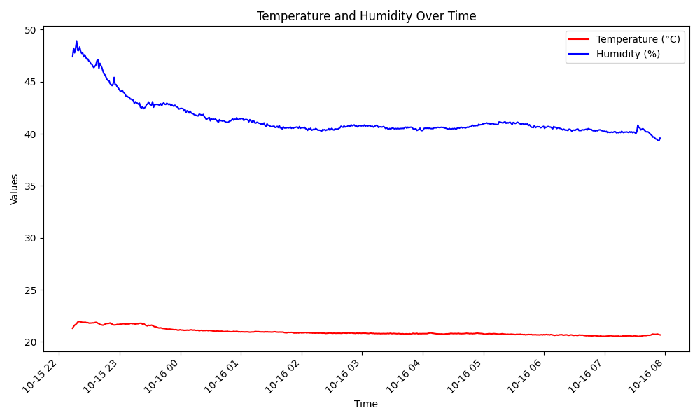
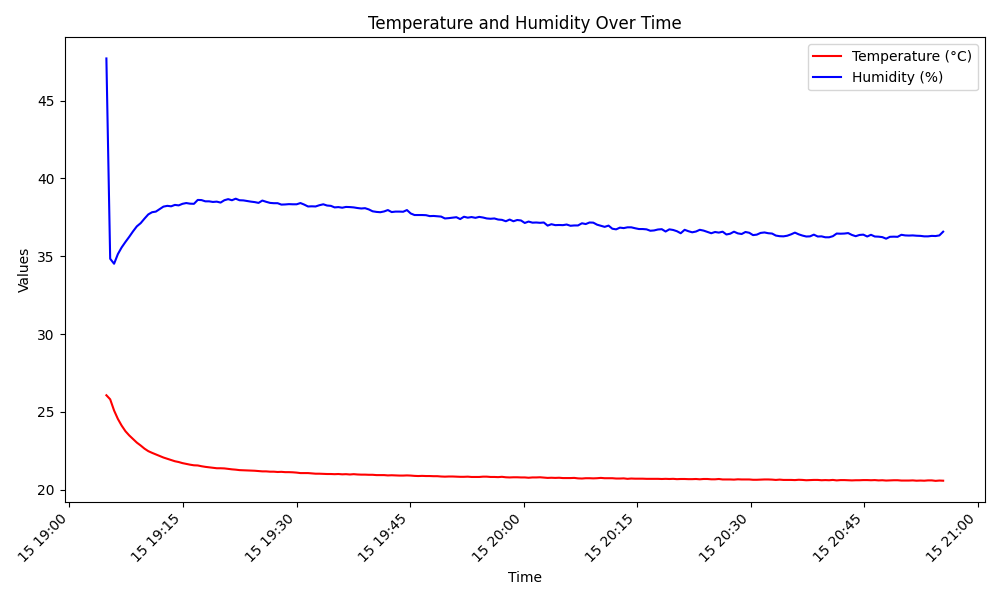

# Grove Beginner Kit Project

This project utilizes the **Grove Beginner Kit** board to read temperature and humidity data, display it on an OLED screen, and send the data to a computer via Serial. The project also includes Python scripts to log the serial data to a file and plot a graph of temperature and humidity readings.

## Software Requirements
- **Arduino IDE**: Used to upload the sketch to the Grove Beginner Kit.
- **Python**: Used to process and visualize the data.

## Files
1. **TemperatureAndHumidityToOLEDtoSerial.ino** - Arduino sketch that reads temperature and humidity data from the DHT20 sensor, displays it on an OLED screen, and sends it to the Serial port.
2. **readSerialToFile.py** - Python script that reads the serial data from the Arduino and saves it to a file called `serial_data.txt`.
3. **plotGraph.py** - Python script that reads `serial_data.txt`, generates a plot for temperature and humidity data, and saves the plot as a PNG file.
4. **readSerialToFile.exe** - Windows executable version of the `readSerialToFile.py` script.
5. **plotGraph.exe** - Windows executable version of the `plotGraph.py` script.

## Required Libraries (for Arduino Sketch)
- **U8g2** - Library for controlling the OLED display.
- **DFRobot_DHT20.h** - Library for the DHT20 temperature and humidity sensor.

These libraries can be installed via the Arduino Library Manager.

## Required Python Packages (for Python Scripts)
- **pyserial** - For communicating with the serial port.
- **numpy** - For handling numerical operations.
- **pandas** - For managing and processing data.
- **matplotlib** - For plotting graphs.

To install all required Python packages, run the following command in your terminal:

```bash
pip install pyserial numpy pandas matplotlib
```

## Instructions

### Arduino Setup
1. **Open the Arduino Sketch**:
   - Open `TemperatureAndHumidityToOLEDtoSerial.ino` in the **Arduino IDE**.
   
2. **Install the Required Libraries**:
   - In the Arduino IDE, go to **Tools > Manage Libraries** and search for the following libraries:
     - **U8g2** for the OLED display.
     - **DFRobot_DHT20** for the DHT20 temperature and humidity sensor.
   - Install these libraries if they are not already installed.

3. **Upload the Sketch to the Board**:
   - Connect your Grove Beginner Kit to your computer using a USB cable.
   - Select the correct board and port from the **Tools** menu in the Arduino IDE.
   - Click **Upload** to upload the sketch to the board.

### Python Setup
4. **Install Python Packages**:
   - Make sure you have Python installed on your system.
   - Run the following command in your terminal to install the required Python packages:
   
     ```bash
     pip install pyserial numpy pandas matplotlib
     ```

5. **Run the `readSerialToFile.py` Script**:
   - Connect your Grove Beginner Kit to the computer.
   - Run the `readSerialToFile.py` script to start reading data from the serial port and saving it to the file `serial_data.txt`.
   
   ```bash
   python readSerialToFile.py
   ```

6. **Run the `plotGraph.py` Script**:
   - After collecting sufficient data, run the `plotGraph.py` script to generate a graph from the data stored in `serial_data.txt`.
   
   ```bash
   python plotGraph.py
   ```
   - The graph for temperature and humidity will be saved as a PNG file in the same folder.
   
 

## Using the Executable Files (for Windows users)
If you don't want to use Python directly, you can use the provided executable files:
1. Run `readSerialToFile.exe` to read and log data from the serial port.
2. Run `plotGraph.exe` to generate the graph from `serial_data.txt`.

